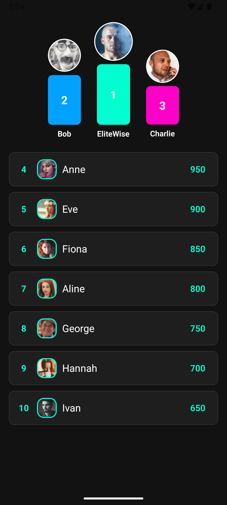

# 🏆 react-native-ranking-leaderboard

**Customizable and modern leaderboard component for React Native apps.**

## Features

- 🥇 Podium for top 3 users
- 📋 Scrollable leaderboard list for other users
- 🎨 Fully customizable styles via props


## Installation

```bash
yarn add react-native-ranking-leaderboard
# or
npm install react-native-ranking-leaderboard
```

## Preview


|---------|---------|
|  |  |

## How to use it?

```ts
const data = [
  { name: 'Alice', points: 1200, picture: 'https://example.com/alice.jpg' },
  { name: 'Bob', points: 1100, picture: 'https://example.com/bob.jpg' },
  { name: 'Charlie', points: 1000, picture: 'https://example.com/charlie.jpg' },
  { name: 'Daisy', points: 950, picture: 'https://example.com/daisy.jpg' },
  { name: 'Ethan', points: 900 },
];
```

```ts
<Leaderboard
  entries={data}
  showPodium={true}
  style={{
    containerStyle: { backgroundColor: '#f0f0f0' },
    podiumStyle: {
      first: { backgroundColor: 'gold' },
      second: { backgroundColor: 'silver' },
      third: { backgroundColor: '#cd7f32' },
    },
    itemStyle: { backgroundColor: '#ffffff' },
    rankStyle: { color: '#333' },
    usernameStyle: { fontSize: 16 },
    pointStyle: { fontWeight: 'bold' },
    avatarStyle: { borderRadius: 18 },
  }}
/>
```

More features will come soon!

Made with passion by [EliteWise](https://github.com/EliteWise) 🧡
